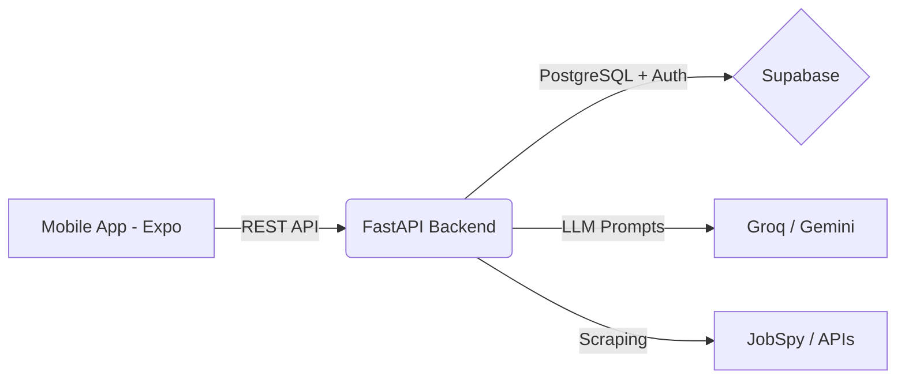

# 🦅 JobHawk 

**The AI-Powered Job Application Agent**

A semi-autonomous AI agent that discovers jobs, scores them against your resume, drafts tailored cover letters, and lets you review & approve applications—all from your pocket.

---

## 🌟 Features
* **AI Resume Parsing**: Automatically extracts skills, experience, and education using Llama/Gemini.
* **Tinder-Style Job Swiper**: Review AI-generated job drafts on the mobile app. Swipe left to pass, swipe right to approve.
* **Smart Job Matching**: Uses vector embeddings and LLM analysis to find jobs that perfectly align with your profile.
* **Application Tracking**: A dedicated Kanban board to track your application pipeline (Saved, Applied, Interview, Offer).

## 🏗️ Architecture



### Tech Stack
* **Mobile**: React Native, Expo, Reanimated, Expo Router
* **Backend**: Python, FastAPI, Uvicorn, LangGraph
* **Database**: Supabase (Postgres, Row Level Security, Auth, Storage)
* **AI/LLMs**: Groq (Llama 3.3 70B), Google AI Studio (Gemini 2.0 Flash)

---

## 🚀 Quick Setup

### 1. Supabase Database
1. Create a project at [supabase.com](https://supabase.com).
2. Go to **SQL Editor** and run `supabase/migrations/001_initial_schema.sql`.
3. Go to **Authentication → Providers** and enable Email Auth.
4. Go to **Storage** and create two private buckets: `resumes` and `drafts`.

### 2. Backend API
The intelligent engine powered by FastAPI and AI models.

```bash
cd backend
cp .env.example .env
# Add your SUPABASE_URL, SUPABASE_ANON_KEY, and API keys to .env
pip install -e .
python scripts/seed_companies.py
uvicorn main:app --host 0.0.0.0 --port 8000 --reload
```

### 3. Mobile App
The React Native app for swiping on jobs and tracking progress.

```bash
cd mobile
cp .env.example .env
# Set EXPO_PUBLIC_BACKEND_URL to your computer's local IP (e.g., http://192.168.1.10:8000)
# Set EXPO_PUBLIC_SUPABASE_URL and EXPO_PUBLIC_SUPABASE_ANON_KEY
npm install
npx expo start -c
```

---

## 📅 Roadmap
- [x] **Phase 1**: Foundation — Resume upload, DB schema, native mobile app shell.
- [x] **Phase 2**: Job Discovery — Multi-source job scraping, ATS parsing, and LLM scoring pipeline.
- [x] **Phase 3**: Mobile Swiper — Tinder-style UI for reviewing and approving AI drafts.
- [ ] **Phase 4**: Automated Follow-ups — Email integration, calendar tracking, interview prep.
- [ ] **Phase 5**: Analytics — Funnel charts, interview-to-offer conversion metrics.
